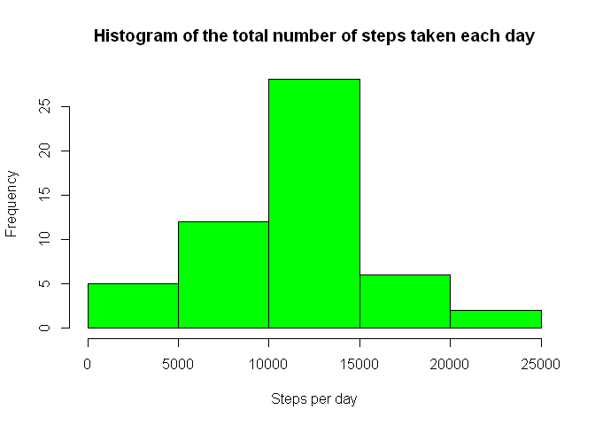
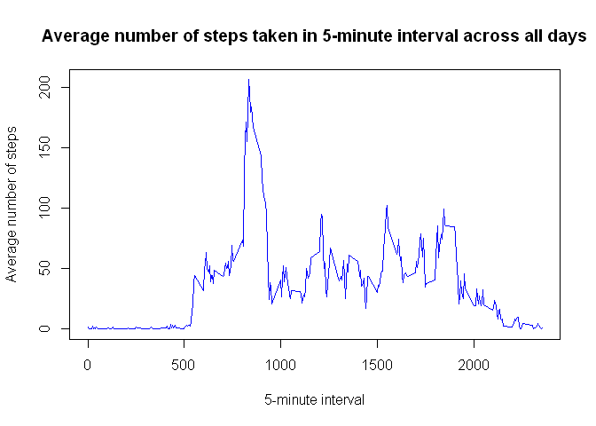
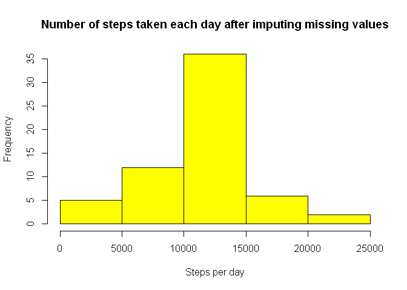
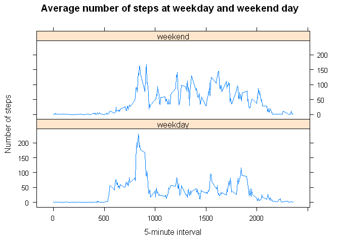

# Reproducible Research: Peer Assessment 1


## Loading and preprocessing the data

Loading data as *data* from corresponding dataset - *activity.csv* (missing values are coded as NA, which is default to read.csv function, so we don't need to handle it separately):


```r
data <- read.csv("activity.csv", stringsAsFactors = FALSE)
```

Converting *date* column from character class to Date class (columns *steps* and *interval* should be integers):


```r
data$date <- as.Date(data$date, format = "%Y-%m-%d")
```

## What is mean total number of steps taken per day?

Calculation of the total number of steps taken per day:


```r
day_agg <- aggregate(steps~date, data=data, sum)
```

Histogram of the total number of steps taken each day:


```r
hist(day_agg$steps, xlab="Steps per day", main="Histogram of the total number of steps taken each day", col="green")
```

 

Calculation and reporting the mean and median of the total number of steps taken per day:


```r
mean(day_agg$steps)
```

```
## [1] 10766.19
```

```r
median(day_agg$steps)
```

```
## [1] 10765
```

## What is the average daily activity pattern?

Time series plot of the 5-minute interval (x-axis) and the average number of steps taken, averaged across all days (y-axis):


```r
int_avg <- aggregate(steps~interval, data=data, mean)
plot(int_avg$interval, int_avg$steps, type="l", xlab="5-minute interval", ylab="Average number of steps", main="Average number of steps taken in 5-minute interval across all days", col="blue")
```

 

Calculation which 5-minute interval, on average across all the days in the dataset, contains the maximum number of steps:


```r
int_avg[int_avg$steps==max(int_avg$steps), "interval"]
```

```
## [1] 835
```

## Imputing missing values

Calculation of the total number of missing values in the dataset:


```r
sum(is.na(data$steps))
```

```
## [1] 2304
```

We use the mean for that 5-minute interval as strategy for filling in all of the missing values in the dataset.

Creation of new dataset *non_na_data* that is equal to the original dataset but with the missing data filled in according to chosen strategy:


```r
non_na_data <- data

for(i in 1:nrow(non_na_data)) {
    if(is.na(non_na_data$steps[i])) {
        non_na_data$steps[i] <- int_avg[int_avg$interval==non_na_data$interval[i],"steps"]
    }
}
```

Histogram of the total number of steps taken each day:


```r
day_agg_non_na <- aggregate(steps~date, data=non_na_data, sum)

hist(day_agg_non_na$steps, xlab="Steps per day", main="Number of steps taken each day after imputing missing values", col="yellow")
```

 

Calculation of the mean and median total number of steps taken per day:


```r
mean(day_agg_non_na$steps)
```

```
## [1] 10766.19
```

```r
median(day_agg_non_na$steps)
```

```
## [1] 10766.19
```

After imputing missing values mean is unchanged and median differ from the estimates from the first part of the assignment only slightly. The impact of imputing missing values on the estimates of the total daily number of steps is relatively small.

## Are there differences in activity patterns between weekdays and weekends?

Setting locale to English so english weekday names are used for plotting:


```r
Sys.setlocale("LC_TIME", "English")
```

Adding a new variable *day* in the dataset *non_na_data* with two levels – *weekday* and *weekend* indicating whether a given date is a weekday or weekend day:


```r
non_na_data$day <- ifelse(weekdays(non_na_data$date) == "Saturday" | weekdays(non_na_data$date) == "Sunday", "weekend", "weekday")
non_na_data$day <- as.factor(non_na_data$day)
```

Panel plot using *lattice* plotting system containing a time series plot of the 5-minute interval and the average number of steps taken, averaged across all weekday days or weekend days:


```r
int_avg_day <- aggregate(steps~interval+day, data=non_na_data, mean)

library(lattice)
xyplot(steps~interval | day, data=int_avg_day, pch=19, main="Average number of steps at weekday and weekend day", xlab="5-minute interval",  ylab="Number of steps", type="l", layout=c(1,2))
```

 
